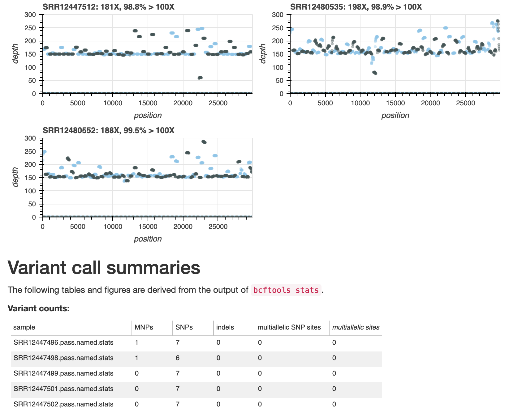

We are excited to launch a new bioinformatics offering using the [Nextflow](https)
reactive workflow framework. Nextflow has been selected as a preferred
framework because of its integration with container technologies, software
package managers and its scalability to cluster- and cloud-scale installations.
Nextflow also has growing user adoption through projects such as nf-core. These
advantages will help us deliver varied workflows with minimal requirements for
the installation of additional software.

* [wf-artic](https://github.com/epi2me-labs/wf-artic) packages the [ARTIC
  Fieldbioinformatics](https://github.com/artic-network/fieldbioinformatics)
  software in a convenient containerised package that can be used to locally
  process multiplexed SARS-CoV-2 sequence data in a more automated manner.
* [wf-hap-snps](https://github.com/epi2me-labs/wf-hap-snps) is a workflow designed to perform haploid SNP calling from
  whole genome sequencing of haploid samples.
* [wf-alignment](https://github.com/epi2me-labs/wf-alignment) packages the [minimap2](https://github.com/lh3/minimap2) software and streamlines the
  process of mapping sequence reads to a reference genome and preparing summary
  statistics. It can also analyse the abundance of known molarity control
  experiments and use this information to derive the abundances of other species
  present in the sample.
* [wf-metagenomics](https://github.com/epi2me-labs/wf-metagenomics) includes the [Centrifuge](https://ccb.jhu.edu/software/centrifuge/) software and appropriate
  indexes to facilitate the taxonomic classification of sequence reads from
  metagenome samples.

Our Nextflow workflows are intended to build upon the best-practice workflows
demonstrated in our [EPI2ME Labs tutorials](/nbindex). The workflows use the same
methods demonstrated in the tutorials but should be more appropriate and
scalable for larger and/or multiplexed datasets. The Nextflow workflows are
distributed via GitHub and we hope that users will fork and customise the
repositories.

The Nextflow workflows all prepare reports that include summary statistics,
tabular data and figures to describe the sequences processed and to highlight
important features of the results obtained. Example reports for each of the
workflows are available from the [Notebook Index](/nbindex).

We support the installation and usage of these workflows on our GridION
sequencing devices; the workflows have also been tested on a variety of Linux
platforms.

We look forwards to feedback and would [welcome requests](https://github.com/epi2me-labs/epi2me-labs.github.io/discussions/) for workflows and
tutorials to be included in future updates.

**Figure 1.** An excerpt from the wf-artic report; the information shown in the
plots can be used to assess depth-of-coverage across the sequenced primer sets
and to identify primers and amplicons that may have dropped out of the
analysis. Additional data and their provenance are shown to further summarise
the data and SARS-CoV-2 variants contained within. The dataset summarised in
this sample report is from sequencing study [PRJNA650037](https://www.ncbi.nlm.nih.gov/bioproject/?term=PRJNA650037).

