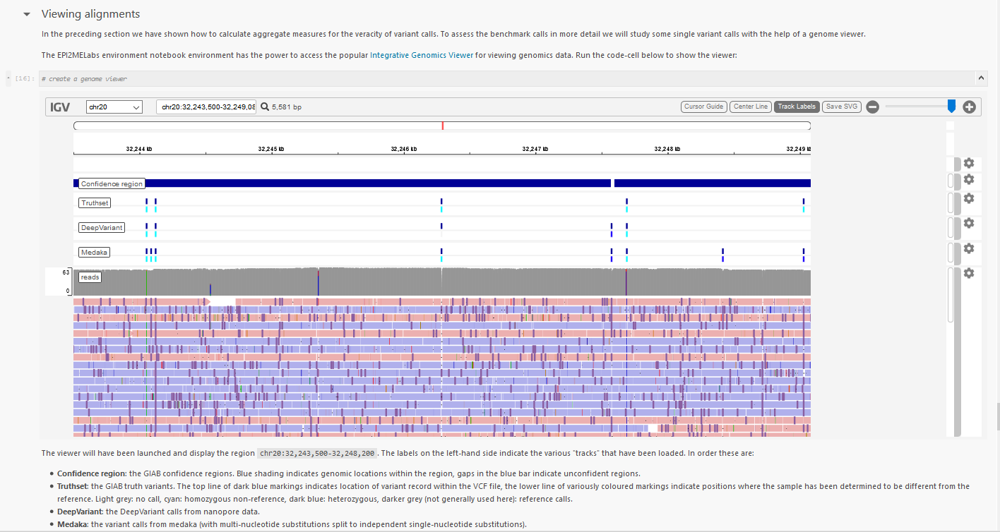
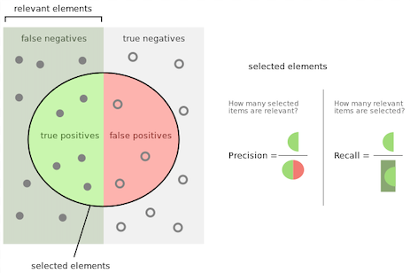

We are pleased to introduce a new release of our EPI2ME Labs.

We are delighted to introduce new tutorials, updated functionality, and cleaner
aesthetics with our 2020-11.01 release of EPI2ME Labs. This is available
immediately, a new LabsLauncher is available on the [downloads](./downloads) page.

In this release we have include IGV.js. IGV is a leading track-based genome
browser. Bringing interactive genome browsing into our notebooks enables
clearer illustration of results and opens new possibilities for customer
developed interactive applications. The JupyterLab [IGV extension](https://github.com/epi2me-labs/igv-jupyterlab)
is available as a standalone component outside of EPI2MELabs.

**Figure 1.** Representation of the SNP benchmark tutorial that shows an IGV view
of the genome and the variants contained within. Bringing this popular genome
viewer into notebooks makes data interpretation more intuitive.

The 2020-11.01 update integrates also new benchmarking tutorials with our recent
[s3://ont-open-data](https://nanoporetech.github.io/ont-open-datasets/)
releases. These benchmark tutorials help users
replicate our performance metrics and demystify the steps involved in
benchmarking SNP and SV detection performance.

A benchmarking analysis of human structural variants is illustrated using SVs
called from our GM24385 dataset using the updated [pipeline-structural-variation](https://github.com/nanoporetech/pipeline-structural-variation)
v2.0.2 software. This tutorial introduces the
SV truth sets maintained by the Genome in a Bottle consortium and demonstrates
a workflow for measuring performance and visually assessing apparent
false-positive SVs.

The same GM24385 dataset is also used for benchmarking our
performance in identifying human single nucleotide variants with a workflow
based on Medaka and DeepVariant. Further analysis of the called
variants illustrates the challenges of identifying SNVs in various genomic
contexts.

**Figure 2.** The benchmarking tutorials included in this release use known and
validated datasets to assess the performance of methods used to identify SNPs
and SVs. The tutorials introduce the scoring of true positives, false positives
and false negatives. The tutorials demonstrate the calculation of precision and
recall using appropriate software packages.

Bug fixes and improvements to the core EPI2ME Labs environment include:

* Numerous minor fixes and amendments to notebooks.
* Fixed the export of graphs
produced in notebooks running on macOS.
* Improvements to the handling of the Pavian webservice used in our metagenomics notebook.
* Updates to the caching and storage of notebooks allows for simpler .ipynb support.
* Aesthetic changes to make the Jupyter server experience a little less orange.

We hope that you find these updates useful. The EPI2ME Labs team would love to
collaborate in the development of new workflows that showcase your software and
we would welcome recommendations for new tutorials and notebooks.
