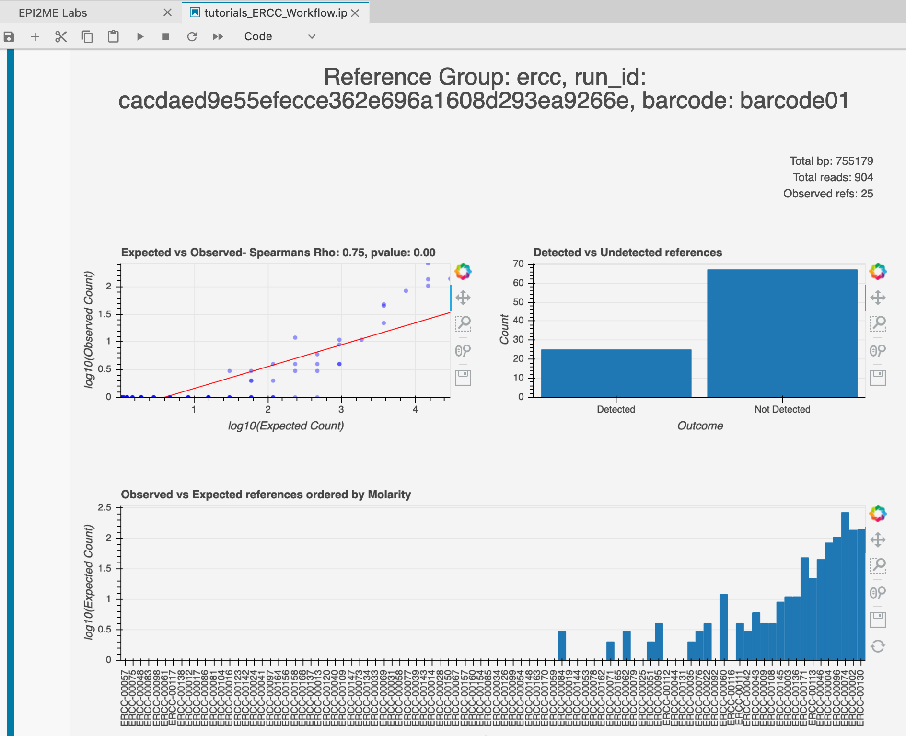
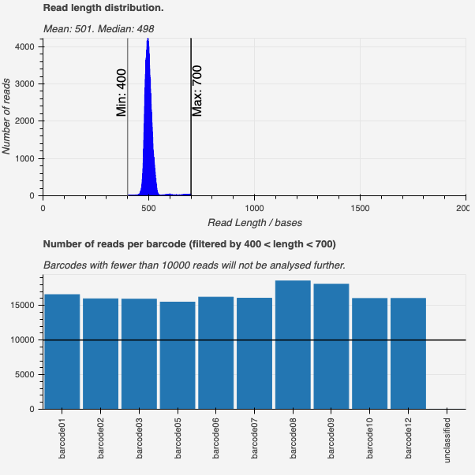

We are delighted to release this month's update to EPI2ME Labs. The 2021-02.01
release addresses some Community feedback and introduces new and updated
tutorials.

**ERCC spike-in quantification**

A new tutorial to assess performance of a transcriptomics study through the use
of spike-in controls.

Our ERCC tutorial introduces the synthetic sequencing controls developed by the
External RNA Controls Consortium (ERCC). These spike-in control sequences are
explored within an expression profiling study and demonstrate how the
performance of a transcriptomics study may be benchmarked.

**Figure 1.** The ERCC tutorial introduces a workflow that looks for the
presence of synthetic RNA transcripts and considers their observed abundance.
The correlation between the observations of each ERCC with its expected counts
can be used to assess study performance. The figure above shows some basic
count measurements that are presented during the analysis.

**SARS-CoV-2 ARTIC update**

The SARS-CoV-2 tutorial introduces the [ARTIC
FieldBioinformatics](https://github.com/artic-network/fieldbioinformatics)
workflow for the assembly and polishing of SARS-CoV-2 genomes.  The workflow
has been updated to demultiplex sequence collections using an expanded range of
both native and rapid barcoding kits - the workflow has been tested with the
"Eco" version of the PCR tiling of SARS-CoV-2 virus protocol. We appreciate
that some users may prefer to perform demultiplexing during sequencing in
MinKNOW; the tutorial now optionally processes FASTQ sequences that have
already been demuliplexed. The tutorial includes a new and more interesting set
of example data that have been picked from project PRJNA650037 at the [European
Nucleotide Archive](https://www.ebi.ac.uk/ena/browser/view/PRJNA650037).

**Figure 2.** The SARS-CoV-2 ARTIC notebook walks users through the assessment
of their ARTIC amplicon data to assess multiplexing efficiency. The final output
of the workflow is a single FASTA formatted file containing a consensus sequence
for each sample suitable for upload to [GISAID](https://www.gisaid.org/)
or inspection with [NextClade](https://clades.nextstrain.org/).

**EPI2ME Labs Launcher support on more computer platforms**

In addition to our previously packaged installations, we are now also packaging
the EPI2ME Labs Launcher for Centos 7, Centos 8 and Ubuntu 20.04. The complete
set of EPI2ME Labs Launcher software can be found at
https://labs.epi2me.io/downloads/.

**Command-line interface (CLI) to Labs Launcher**

EPI2ME Labs has been installed on a variety of computer platforms. User
feedback has revealed that there is interest in the installation of the EPI2ME
Labs container on headless servers that offer greater memory and CPU resources.
To support the installation of EPI2ME Labs on these more powerful computer
systems, the EPI2ME Labs Launcher has been updated to include CLI functionality
to start, stop, and update the appropriate services. More information on the
CLI interface to the EPI2ME Labs Launcher can be found in a [separate blog
post](/launcher_cli).

**Maintenance, updates and utility**

The software environment in the epi2melabs-notebook has been updated to use
Python version 3.8 (from Python 3.6). Housekeeping during the preparation of
the docker container has considerably reduced the size of the container
download - the download is now only approximately 1.3G in size. To increase the
legibility of the functional code within the EPI2ME Labs tutorials and
notebooks, we are introducing new software packages to simplify and structure
analyses. [aplanat](https://github.com/epi2me-labs/aplanat)
has been used in earlier tutorials to simplify the
preparation of figures - in this release we are introducing
[mapula]('https://github.com/epi2me-labs/mapula') to simplify the mathematics
of processing read statistics and count information from BAM alignment files.

We look forwards to your feedback. We would welcome suggestions for future
tutorials and we would gratefully review Community contributions.
