# EPI2MELabs Quick Start Guide

The following guide illustrates installation and use of the EPI2ME Labs
notebook server. 

EPI2ME Labs can also be run on Windows 10, macOS and Linux. For Windows and
macOS platforms follow the instructions at [Docker
Desktop](https://docs.docker.com/desktop/) to install Docker. *Docker
installations through Docker Toolbox are not supported. Please also be sure to
select the Hyper-V option during installation.* The EPI2ME Labs Launcher
application is available for these platforms from the [Software
Downloads](https://community.nanoporetech.com/downloads) page on the Nanopore
Community or the [GitHub
release](https://github.com/epi2me-labs/labslauncher/releases/latest) page.
Please see also the Windows/MacOS Docker Install section below.

## Installation

The EPI2ME Labs server runs in a
[Docker](https://www.docker.com/resources/what-container) container in order to
provide an isolated and resettable environment. It can be controlled using the
EPI2ME Labs launcher application. The instructions below will install both of
these tools onto your system


## GridIon/PromethION Docker install

Docker is not currently installed by default on GridION devices. To install
docker follow the instructions below.

1. Click on the **Search your computer** button.

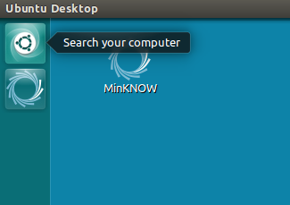

2. Search for "terminal", and click on the Terminal application:

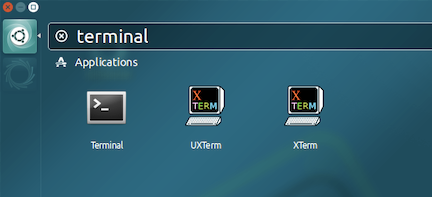

A terminal window will open:

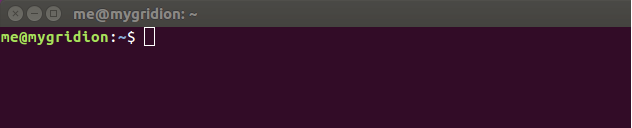

3. Run the Docker installation command (you can copy and paste this into the
   terminal window and press **Enter**):
   ```
   sudo apt update
   sudo apt install docker.io
   sudo usermod -aG docker <username>
   ```
   where `<username>` should be replaced with your computer username.
4. Close your terminal window.
5. Log out of your GridION and log back in again.
6. Open a new terminal window.
7. To test docker is working correctly, run ``` docker run hello-world ```

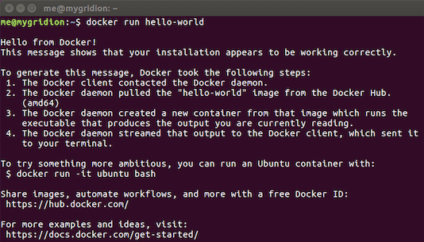

## Windows and macOS Docker install

EPI2ME Labs is supported on Windows 10 Profession (and Enterprise) and macOS
through [Docker Desktop](https://docs.docker.com/desktop/). Use of Docker
Desktop on Windows 10 Home through the use of Windows Subsytem for Linux 2
(WSL2) is untested. For the most part, users should simply follow the
installation instructions for their system on the Docker website.


### Data shares

During installation users may be asked to allow Docker access to parts of their
file system; users should grant access to any locations where data resides they
wish to analyse with EPI2ME Labs. In particular users are likely to want to add
the MinKNOW output directory as a share in Docker.

It is possible to allow data shares to Docker after installation by opening the
Docker Desktop program and navigating to its settings page:

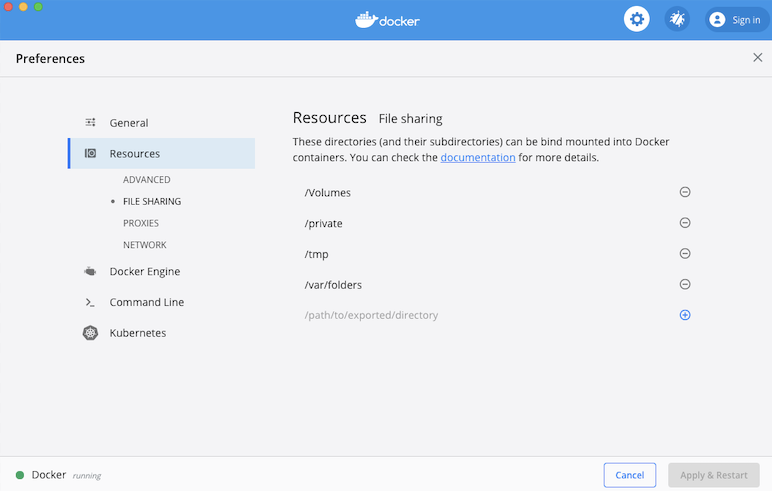

On Windows 10 it may be possible to avoid having to add folders manually in the
Docker Desktop program by checking that application notifications are enabled
in the system Settings:

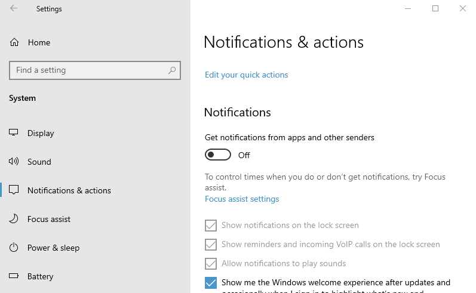

With notifications enabled, users may see pop-ups like the following when
running the EPI2ME Labs launcher; users should click "Share it" in these
instances.

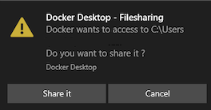

### Resource Limits

By default Docker Desktop sets fairly conservative resource limits for itself,
you may wish to change these in the Docker Desktop settings pane. We recommend
setting the Memory limit to at least 8Gb (some EPI2ME Labs tutorials may
require more as indicated in their introductions) and the CPUs to one or two
less than the maximum value for your system.

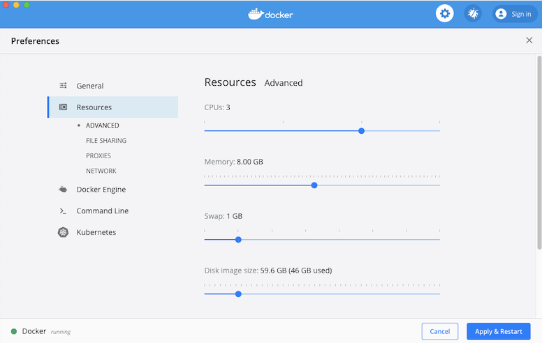

## Install the EPI2ME Labs launcher application

The EPI2ME Labs launcher application provides a convenient way to start, stop,
and update the EPI2ME Labs notebook server. The source code for the application
is available in our GitHub
[repository](https://github.com/epi2me-labs/labslauncher)

### Installing the Launcher on GridION and PromethION

The EPI2MELabs Launcher is most easily installed:

1. Copy and paste the following into the terminal window and press **Enter**:
   ```
   sudo apt update
   sudo apt install ont-epi2melabs-launcher
   ```
2. Click on the Search your computer icon, and search for "EPI2ME". Then click
   on the **EPI2ME-Labs Server Control** icon. This will start the launcher.
   
#### Reinstallation of the Launcher on GridION and PromethION

In the event you wish to reinstall the Launcher on GridION and PromethION it is 
vital to run purge to remove the original version of the Launcher and its associated 
configuration files.

1. Copy and paste the following into the terminal window and press **Enter**:
   ```
   sudo apt purge ont-epi2melabs-launcher
   sudo apt autoremove
   ```
2. Copy and paste the following into the terminal window and press **Enter**:
   ```
   sudo apt update
   sudo apt install ont-epi2melabs-launcher
   ```
The first step removes the Launcher and any associated configuration files and dependencies 
that are only required by the Launcher. The second step reinstalls the labslauncher.

### Installing the Launcher on Windows 10 and macOS

We provide a Windows 10 installer and an macOS Application bundle on the
[Downloads](/downloads) page. Simply download and run these files to install
the EPI2MELabs Launcher on these platforms.


## Start EPI2ME Labs from the launcher

The EPI2ME Labs launcher interface has all the functionality required for users
to manage the EPI2ME Labs notebook server.

1. To start a notebook server click the **Start** button to reach the **Start
   Server** screen:

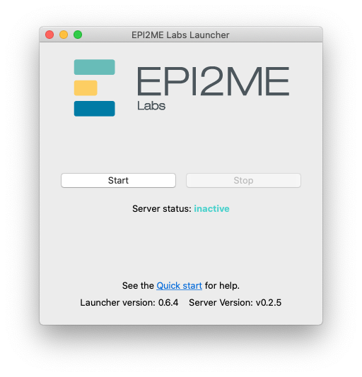

There are three options on the Start Server page:
- **Select path:** the location on your computer which you want to be visible
  within the notebooks
- **token:** a security token (password) to allow access to the notebook
  interface
- **port:** network port to access the notebook server interface

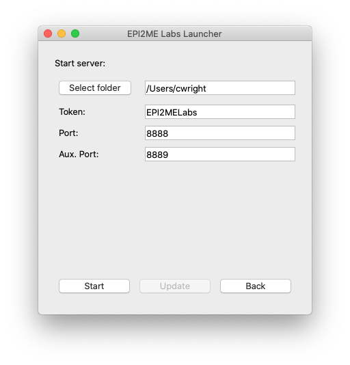

2. The data location is pre-filled with a default data path. To select a
different folder, click **Select path** to show the selection dialog:

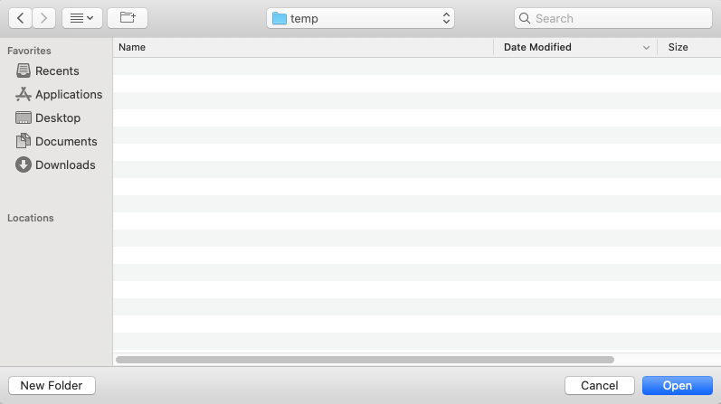

3. Navigate the directory tree until the dialog is within your selected folder,
then click **Open**.

4. We strongly encourage updating the token to a unique value. The token
provides an authentication method that allows only trusted users access to the
EPI2ME Labs server and is used as an additional security layer to help prevent
other users on the network from running code and accessing data. This token
will be used later in the workflow to connect Google Colaboratory to the
server.

5. Click **Start** on the main screen to start the notebook server.

> **The first time a server is started the server components must be
> downloaded. This will not happen on subsequent server starts.**


When the server has successfully launched, there will be a message at the
bottom of the launcher interface stating "Server status: running.":

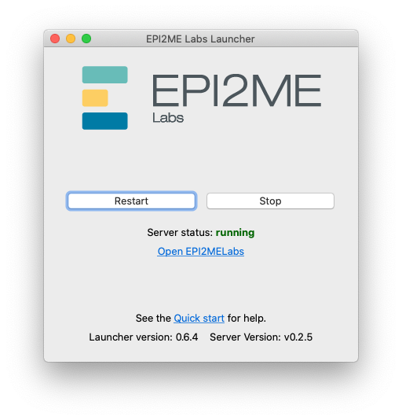

### Updating the server

The EPI2ME Labs launcher application automatically detects when updates are
available to the notebok server. Oxford Nanopore Technologies' may
occassionally provide updates to provide new features or improved performance.

When an update is available attempting to start or restart the notebook server
when an update is available will result in the following being displayed:

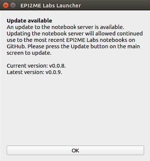

1. To update the server, press the **Update** button on the main screen. The
new server components will be downloaded:

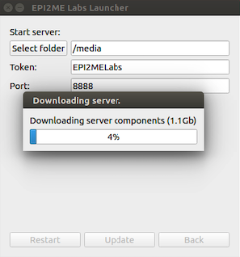

### Run a tutorial

1. With the EPI2ME Labs notebook server running, click the Open EPI2MELabs link
within the Launcher:
   
2. On the landing page select the notebook you wish to open. Opening a notebook
template will create a copy of the file as a new document for you to edit.
   
3. You can see all your data in the location you provided in the launcher by 
clicking **/epi2melabs** in the sidebar:
   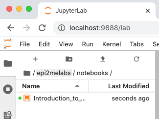
4. To copy your own data into the tutorial, right-click on the data file and
select **Copy path**.
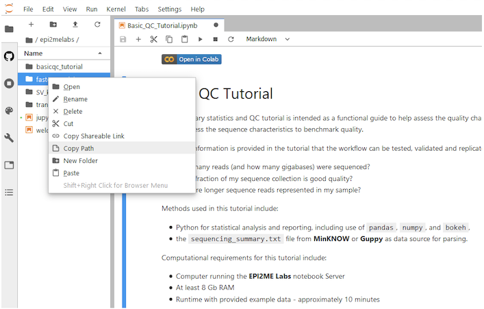
5. Follow the guidance provided in the tutorial to perform data analysis.

#### Running code cells

Running code cells in JupyterLab requires clicking the **play** button in the
navigation bar at the top of the screen (or to the right-hand side of a code cell).
There is also a **"Run"** tab that can be used to run multiple cells.

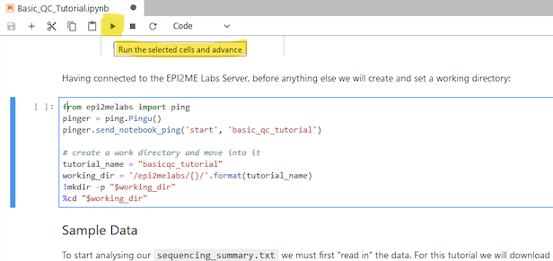

### Bookmarks and navigating notebooks

The JupyterLab environment provides a table of contents menu in the left-hand
sidebar. These navigation prompts can also be used to *fold* content visibility
in the notebook.

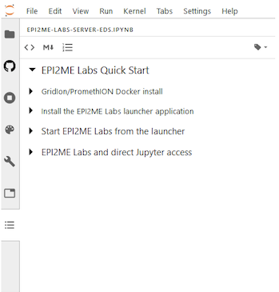


